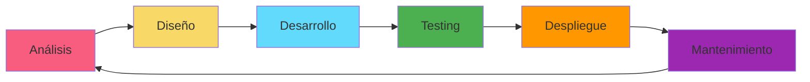

<div align="center">
  
# 👋 Eduardo Hernández Morales
### Full Stack Developer | Backend Architect | UX Designer

[](https://linkedin.com/in/eduardo-hernandez-885365288/)
[](https://www.leetcode.com/grayz)
[](mailto:zohanshane@gmail.com)
[](https://github.com/ZedhGray)


</div>

---

## 🚀 Sobre Mí
```java
public class EduardoHernandez {
    private String location = "Morelia, Michoacán, México";
    private String education = "Licenciatura en Físico-Matemático";
    private String[] currentRole = {
        "Full Stack Developer @ García Rines & Neumáticos",
        "External Consultant @ ICOM Sistema"
    };
    
    private String[] expertise = {
        "Backend Architecture",
        "API Development", 
        "Database Design",
        "UX/UI Design",
        "Graphic Design"
    };
    
    public String getPhilosophy() {
        return "Si no puedes resolver ese problema, entonces existe un problema "
             + "más sencillo que sí podrás resolver: encuéntralo. - George Pólya";
    }
}
```

**🎯 Especializado en:** Crear soluciones tecnológicas **eficientes, escalables y centradas en el usuario**, uniendo arquitectura sólida, experiencia de usuario, diseño visual y visión de negocio.

**🔭 Proyectos actuales:**
- 🏢 Desarrollando sistemas empresariales para García Rines & Neumáticos
- 🛠️ Consultoría y optimización de plataforma nacional para ICOM Sistema
- 📱 Aplicación móvil con búsqueda geolocalizada por GPS
- 🤖 Estudiando Inteligencia Artificial y Machine Learning con Python

---

## 💼 Experiencia Profesional

### 🏢 García Rines & Neumáticos
**Full Stack Developer | Software Engineer | Graphic Designer**  
*Agosto 2024 - Presente | Zihuatanejo, Guerrero, México*

- 🔧 Diseño e implementación de APIs RESTful con Spring Boot
- 📊 Desarrollo de servicios backend escalables con PostgreSQL
- 🎨 Diseño de interfaces con React y UX/UI
- 🎯 Marketing digital y diseño de marca empresarial
- 🌐 Creación de páginas web y diseño para redes sociales

### 🔍 ICOM Sistema
**Consultor Externo**  
*Enero 2024 - Presente | Zihuatanejo, Guerrero, México*

- ✅ Testing y QA de nuevas funcionalidades de la plataforma
- ⚙️ Optimización de funciones backend para resolver problemas técnicos
- 🛠️ Desarrollo de soluciones personalizadas según necesidades del cliente
- 📈 Mejora de estabilidad y escalabilidad del sistema

---

## 🛠️ Stack Tecnológico

### Backend Development


### Frontend Development


### Styling & Design


### Mobile Development


### Desktop Development


### Databases & Backend Services


### Design & Multimedia


### Game Development


### Cloud & DevOps


---

## 📊 GitHub en Números

<div align="center">
```text
🔥 5 Contribuciones en 2026
📚 21 Repositorios Públicos
⭐ Miembro desde hace 3+ años
💻 Lenguajes: Java, JavaScript, Python, TypeScript
```

</div>

---

## 🎓 Educación

🎓 **Licenciatura en Físico-Matemático**  
*Universidad Michoacana de San Nicolás de Hidalgo* | 2018 - 2024  
Especialización en Física teórica y Matemáticas

💻 **Full Stack Development Bootcamp**  
*Henry* | Octubre 2023 - Marzo 2024  
Desarrollo Full Stack intensivo

🌐 **Programación Front-end con React**  
*Academlo* | 2018  
Desarrollo Front-end y React

---

## 🎯 Áreas de Especialización

<table>
<tr>
<td width="50%">

### Backend Architecture 🏗️
- Diseño de APIs REST seguras y escalables
- Arquitectura en capas y MVC
- Integración de bases de datos
- Lógica de negocio compleja
- Optimización de rendimiento

</td>
<td width="50%">

### Frontend Development 🎨
- Aplicaciones web dinámicas con React
- UX/UI Design enfocado en conversión
- Diseño responsive y accesible
- Optimización de rendimiento
- Prototipado funcional

</td>
</tr>
<tr>
<td width="50%">

### Mobile Development 📱
- Aplicaciones nativas con Kotlin
- React Native multiplataforma
- Integración con servicios backend
- Geolocalización GPS
- UI/UX móvil

</td>
<td width="50%">

### Design & Multimedia 🎨
- Diseño gráfico profesional
- Branding y marca empresarial
- Marketing digital
- Edición de video
- Diseño 3D con Blender

</td>
</tr>
</table>

---

## 🔧 Servicios Profesionales

<div align="center">

| 🔨 Backend | 🎨 Frontend | 📱 Mobile | 🖥️ Desktop |
|:---:|:---:|:---:|:---:|
| APIs REST | React Apps | Android Nativo | Python Apps |
| Spring Boot | Next.js | React Native | Electron |
| Microservicios | Vue.js | GPS Integration | PyQt6 |
| PostgreSQL | TypeScript | UX Móvil | FTP Systems |
| Node.js | Redux | Apps Empresariales | Windows Apps |

</div>

### 💼 ¿Qué puedo hacer por ti?
```typescript
const myServices = {
    desarrollo: {
        backend: "APIs REST robustas con Spring Boot y Node.js",
        frontend: "Aplicaciones React modernas y responsivas",
        mobile: "Apps Android nativas e híbridas",
        desktop: "Software multiplataforma con Python/Electron"
    },
    diseño: {
        uxui: "Interfaces intuitivas centradas en el usuario",
        grafico: "Branding, logos y material publicitario",
        web: "Diseño web moderno y atractivo",
        multimedia: "Edición de video y contenido visual"
    },
    consultoría: {
        arquitectura: "Diseño de sistemas escalables",
        optimización: "Mejora de rendimiento y código",
        baseDatos: "Modelado y optimización de BD",
        devops: "Integración y despliegue continuo"
    }
};
```

---

## 🌟 Proyectos Destacados

<div align="center">

| Proyecto | Tecnologías | Descripción |
|:---:|:---:|:---:|
| 🏢 **Sistema Empresarial** | Spring Boot + React + PostgreSQL | Gestión integral para García Rines |
| 🔍 **Plataforma ICOM** | Java + PostgreSQL | Optimización de sistema nacional |
| 📱 **App GPS** | Kotlin + Google Maps | Búsqueda geolocalizada en desarrollo |
| 🤖 **AI Projects** | Python + TensorFlow | Machine Learning y IA |

</div>

---

## 💡 Mi Filosofía de Desarrollo

<div align="center">

> **"Si no puedes resolver ese problema, entonces existe un problema más sencillo que sí podrás resolver: encuéntralo."**  
> — George Pólya

<br>

### 🎯 Mi Enfoque

**Arquitectura Sólida** • **Experiencia de Usuario** • **Diseño Visual** • **Visión de Negocio**

Construyo productos **confiables**, **escalables** y **rentables**

</div>

---

## 📈 Metodología de Trabajo


---

## 📫 Conectemos

<div align="center">

**¿Tienes un proyecto en mente? ¡Hablemos!** 💬

[](https://linkedin.com/in/eduardo-hernandez-885365288/)
[](mailto:zohanshane@gmail.com)
[](https://www.leetcode.com/grayz)
[](https://github.com/ZedhGray)

<br>

### 💼 Disponible para proyectos freelance y colaboraciones

<br>


</div>

---

<div align="center">

### ⭐️ Si mis proyectos te resultan útiles, ¡no olvides darles una estrella!

**Desarrollado con ❤️, ☕ y mucho código**

*Eduardo Hernández | Full Stack Developer*

---

**"El mejor momento para plantar un árbol fue hace 20 años. El segundo mejor momento es ahora."**

</div>
