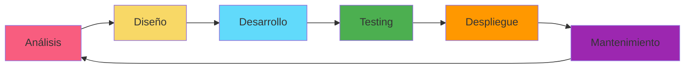

<div align="center">
  
# 👋 Eduardo Hernández Morales
### Backend Developer | Java & Spring Boot Specialist

[](https://linkedin.com/in/eduardo-hernandez-885365288/)
[](https://www.leetcode.com/grayz)
[](mailto:zohanshane@gmail.com)
[](https://github.com/ZedhGray)


</div>

---

## 🚀 Sobre Mí
```java
public class EduardoHernandez {
    private String location = "Morelia, Michoacán, México";
    private String education = "Licenciatura en Físico-Matemático";
    private String[] currentRole = {
        "Software Developer @ Lucas Tech",
        "Junior Software Developer @ García Rines & Neumáticos",
        "External Consultant @ ICOM Sistema"
    };
    
    private String[] expertise = {
        "Backend Development",
        "API REST Design",
        "Microservices",
        "Database Design & Optimization",
        "Process Automation with Python"
    };
    
    public String getPhilosophy() {
        return "Si no puedes resolver ese problema, entonces existe un problema "
             + "más sencillo que sí podrás resolver: encuéntralo. - George Pólya";
    }
}
```

**🎯 Especializado en:** Construir **APIs robustas, microservicios escalables y sistemas empresariales confiables** con Java y Spring Boot, aplicando arquitectura limpia y buenas prácticas de desarrollo.

**🔭 Proyectos actuales:**
- 🏗️ Desarrollo de microservicios bajo arquitectura distribuida en Lucas Tech
- 🏢 Sistema interno de ventas y automatización de procesos para García Rines & Neumáticos
- 🛠️ Consultoría y optimización de SaaS nacional para ICOM Sistema
- 🤖 Estudiando Inteligencia Artificial y Machine Learning con Python

---

## 💼 Experiencia Profesional

### 🏗️ Lucas Tech
**Software Developer**  
*Enero 2026 - Presente | Monterrey, Nuevo León, México*

- 🔧 Colaboración en desarrollo de microservicios bajo arquitectura Spring Boot
- 🤝 Trabajo con desarrolladores senior en resolución de problemas técnicos
- ⚙️ Mejora y mantenimiento de servicios backend en arquitectura distribuida
- 📐 Aplicación de patrones de diseño y buenas prácticas de desarrollo

### 🏢 García Rines & Neumáticos
**Junior Software Developer**  
*Agosto 2024 - Presente | Zihuatanejo, Guerrero, México*

- 🔧 Desarrollo de sistema interno de ventas con Java y base de datos SQL
- 🤖 Automatización de procesos administrativos mediante Python
- 📊 Diseño funcional de interfaces para optimizar operaciones del negocio
- 🗄️ Modelado e integración de bases de datos relacionales

### 🔍 ICOM Sistema
**Consultor Externo**  
*Enero 2024 - Enero 2025 | Zihuatanejo, Guerrero, México*

- ✅ Colaboración en desarrollo y optimización de SaaS líder nacional en POS
- ⚙️ Automatización de procesos y mejoras funcionales del sistema
- 🛠️ Resolución de problemas técnicos en el backend
- 📈 Mejora de estabilidad y escalabilidad del sistema

---

## 🛠️ Stack Tecnológico

### Backend Development (Core)


### Architecture & Patterns


### Databases & Backend Services


### Frontend Development


### Cloud & DevOps


### Automation & AI


---

## 📊 GitHub Stats

<div align="center">

**Backend Developer**

</div>

---

## 🎓 Educación

🎓 **Licenciatura en Físico-Matemático**  
*Universidad Michoacana de San Nicolás de Hidalgo* | 2018 - 2024  
Especialización en Física teórica y Matemáticas

💻 **Full Stack Development Bootcamp**  
*Henry* | Octubre 2023 - Marzo 2024  
Desarrollo Full Stack intensivo

🌐 **Programación Front-end con React**  
*Academlo* | 2022  
Desarrollo Front-end y React

---

## 🎯 Áreas de Especialización

<table>
<tr>
<td width="50%">

### Backend Development 🏗️
- Diseño de APIs REST seguras y escalables
- Microservicios
- Integración y modelado de bases de datos
- Lógica de negocio compleja
- Optimización de rendimiento

</td>
<td width="50%">

### Automatización & Tooling 🤖
- Scripts de automatización con Python
- Herramientas internas de gestión
- Procesamiento y transformación de datos
- Integración con servicios externos
- Optimización de procesos operativos

</td>
</tr>
</table>

---

## 🔧 Servicios Profesionales

<div align="center">

| 🔨 APIs REST | 🏗️ Microservicios | 🗄️ Bases de Datos | 🤖 Automatización |
|:---:|:---:|:---:|:---:|
| Spring Boot | Arquitectura Dist. | PostgreSQL | Python Scripts |
| Node.js | Docker | MySQL | Procesos Admin. |
| Autenticación JWT | API Gateway | MongoDB | Integración APIs |
| Documentación | Load Balancing | Modelado BD | Reportes automáticos |
| Versionado | Spring Cloud | Query Optimization | Flujos de trabajo |

</div>

### 💼 ¿Qué puedo hacer por ti?
```typescript
const myServices = {
    backend: {
        apis: "APIs REST robustas, seguras y bien documentadas",
        microservicios: "Arquitectura distribuida con Spring Boot",
        baseDatos: "Modelado, optimización e integración de bases de datos",
        automatizacion: "Scripts Python para optimizar procesos operativos"
    },
    consultoría: {
        arquitectura: "Diseño de sistemas escalables y mantenibles",
        optimización: "Mejora de rendimiento y calidad de código",
        baseDatos: "Auditoría y optimización de consultas y esquemas",
        devops: "Contenedorización y despliegue continuo"
    },
    extras: {
        frontend: "Integración con React/Next.js cuando el proyecto lo requiere",
        documentacion: "Documentación técnica clara con Swagger/OpenAPI",
        testing: "Pruebas unitarias e integración para mayor confiabilidad"
    }
};
```

---

## 🌟 Proyectos Destacados

<div align="center">

| Proyecto | Tecnologías | Descripción |
|:---:|:---:|:---:|
| 🏗️ **Microservicios Lucas Tech** | Spring Boot + Docker | Arquitectura distribuida en producción |
| 🏢 **Sistema de Ventas** | Java + PostgreSQL + Python | Gestión y automatización para García Rines |
| 🔍 **Plataforma ICOM** | Java + PostgreSQL | Optimización de SaaS nacional de POS |
| 🤖 **AI Projects** | Python + TensorFlow | Machine Learning y automatización |

</div>

---

## 💡 Mi Filosofía de Desarrollo

<div align="center">

> **"Si no puedes resolver ese problema, entonces existe un problema más sencillo que sí podrás resolver: encuéntralo."**  
> — George Pólya

<br>

### 🎯 Mi Enfoque

**Arquitectura Sólida** • **Código Limpio** • **Rendimiento** • **Escalabilidad**

Construyo backends **confiables**, **mantenibles** y **listos para producción**

</div>

---

## 📈 Metodología de Trabajo

```mermaid
graph LR
    A[Análisis] --> B[Diseño]
    B --> C[Desarrollo]
    C --> D[Testing]
    D --> E[Despliegue]
    E --> F[Mantenimiento]
    F --> A
    
    style A fill:#F85D7F
    style B fill:#F8D866
    style C fill:#61DAFB
    style D fill:#4CAF50
    style E fill:#FF9800
    style F fill:#9C27B0
```

---

## 📫 Conectemos

<div align="center">

**¿Tienes un proyecto en mente? ¡Hablemos!** 💬

[](https://linkedin.com/in/eduardo-hernandez-885365288/)
[](mailto:zohanshane@gmail.com)
[](https://www.leetcode.com/grayz)
[](https://github.com/ZedhGray)

<br>

### 💼 Disponible para proyectos freelance y colaboraciones

<br>


</div>

---

<div align="center">

### ⭐️ Si mis proyectos te resultan útiles, ¡no olvides darles una estrella!

**Desarrollado con ❤️, ☕ y mucho código**

*Eduardo Hernández | Backend Developer*

---

**"El mejor momento para plantar un árbol fue hace 20 años. El segundo mejor momento es ahora."**

</div>
